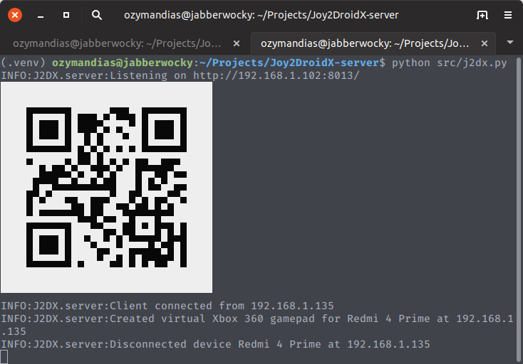

# Joy2DroidX



Joy2DroidX allows you to use your Android device as a
virtual Xbox 360 controller or DualShock 4 gamepad.

It consists of a server that runs on Windows and Linux
and an Android app. While there's nothing preventing the
app from running on any Android device, it's been only
tested on Android phones.


### Server

The server (this app) listens for input from connected
Android devices and manages creation/deletion of virtual devices.
It uses UInput on Linux and [ViGEm](https://github.com/ViGEm) on Windows.

While running the server *does not* require any special
privileges, the initial setup (setting UInput permissions on Linux and installing driver on Windows) *requires root/administrator* access.

### Client

You can find more information about the Android app as well the sources [here](https://github.com/OzymandiasTheGreat/Joy2DroidX).


## Installation

Joy2DroidX is distributed as a portable app on Windows and as an AppImage on Linux.
You can find latest versions on [releases page](https://github.com/OzymandiasTheGreat/Joy2DroidX-server/releases).

Alternatively, if you have python 3 and pip setup, you can install from [pypi](https://pypi.org/project/j2dx/):

```
pip install j2dx
```


## Usage

### First run

You need to setup the system before the first run.
Joy2DroidX provides a convenience command that does this for you, it however requires root/administrator access.

Just run `j2dx --setup` as root or from administrator command prompt.

On Linux this will create a udev rule for UInput and add current user to `j2dx` group. If you're not using sudo or user detection fails for another reason, you can provide username as an argument to `--setup`.
For udev rules and group changes to take effect you'll have to restart your system.

On Windows this will download [ViGEmBus driver](https://github.com/ViGEm/ViGEmBus) and prompt you to install it.
Once the driver is setup you can use Joy2DroidX, no restart necessary.

### Regular usage

Run `j2dx` (on windows you can just double click `j2dx.exe`), scan QRCode from the Android app and that's it.
Everything should just work. Switching device mode is done from the Android app.

The server should not need any extra configuration.
If you have an unsual network setup or default port is used by another process, there are a couple option you can modify:

- `-p, --port` allows you to use a different port. Default is 8013.
- `-H, --host` if hostname detection fails you can specify a hostname or your computers IP address.
- `-d, --debug` you shouldn't need this one. If you do encounter bugs, run `j2dx -d` and open an issue with a link to debug output (use a gist or pastebin for this).
